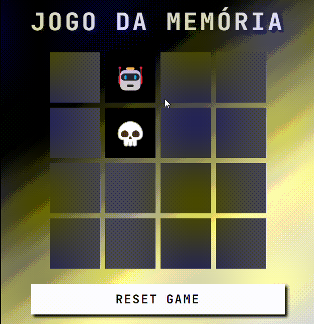

# Jogo da Memória Emoji 🎮

Bem-vindo ao **Jogo da Memória Emoji**! Um clássico jogo de memória com temática moderna, desenvolvido para testar suas habilidades de concentração e memorização. Combine pares de emojis em um ambiente visualmente atraente e responsivo!

[](https://developer.mozilla.org/pt-BR/docs/Web/HTML)  
[](https://developer.mozilla.org/pt-BR/docs/Web/CSS)  
[](https://developer.mozilla.org/pt-BR/docs/Web/JavaScript)



## ✨ Funcionalidades Principais

- **16 Cartas Emoji:** Combinações variadas de ícones divertidos
- **Sistema de Pareamento:** Encontre os pares idênticos para vencer
- **Design Dinâmico:** Gradiente de cores e efeitos visuais modernos
- **Botão Reset:** Reinicie o jogo a qualquer momento
- **Animações Suaves:** Efeitos de flip 3D nas cartas
- **Contador de Vitória:** Alerta automático ao completar o jogo

## 🚀 Como Jogar

1. **Clone o repositório:**
   ```bash
   git clone https://github.com/DanAntunes/memory-game
   ```
2. Abra o arquivo ``index.html`` no navegador.

## Regras do Jogo

- Clique em duas cartas para revelar seus emojis
- Se formar um par, as cartas permanecem visíveis
- Se não forem iguais, elas viram novamente
- Encontre todos os pares para vencer!

## 🔧 Tecnologias Utilizadas
- **HTML5**: Estrutura semântica do jogo
- **CSS3**:
  - Gradientes animados
  - Transformações 3D
  - Design responsivo
- JavaScript Vanilla:
   - Lógica do jogo
   - Manipulação do DOM
   - Sistema de aleatorização
 - Google Fonts: JetBrains Mono para tipografia técnica
